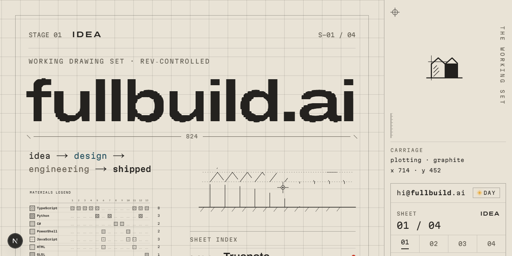
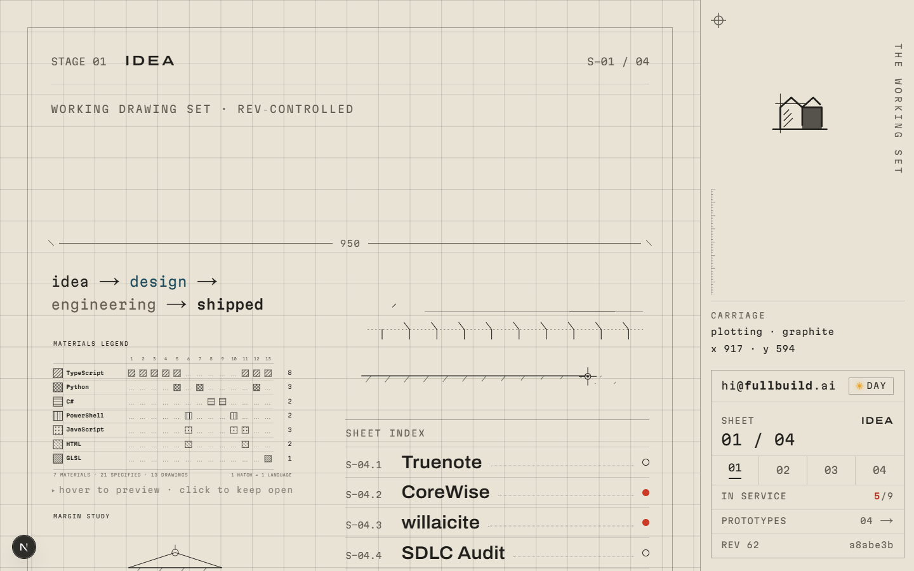
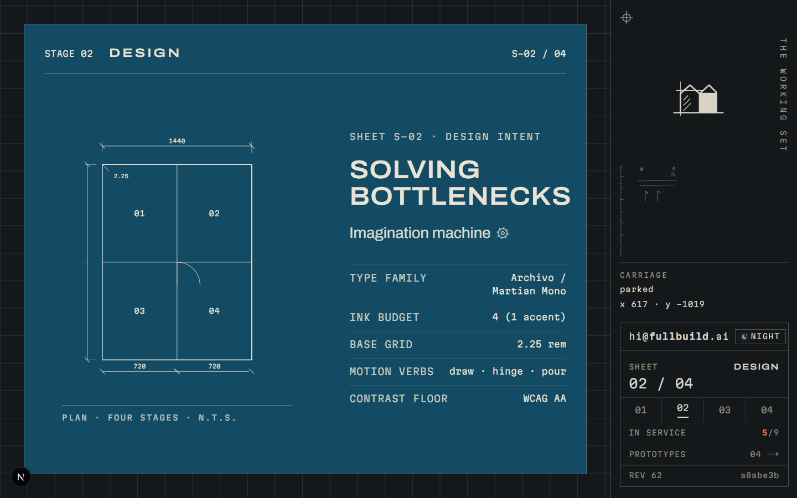
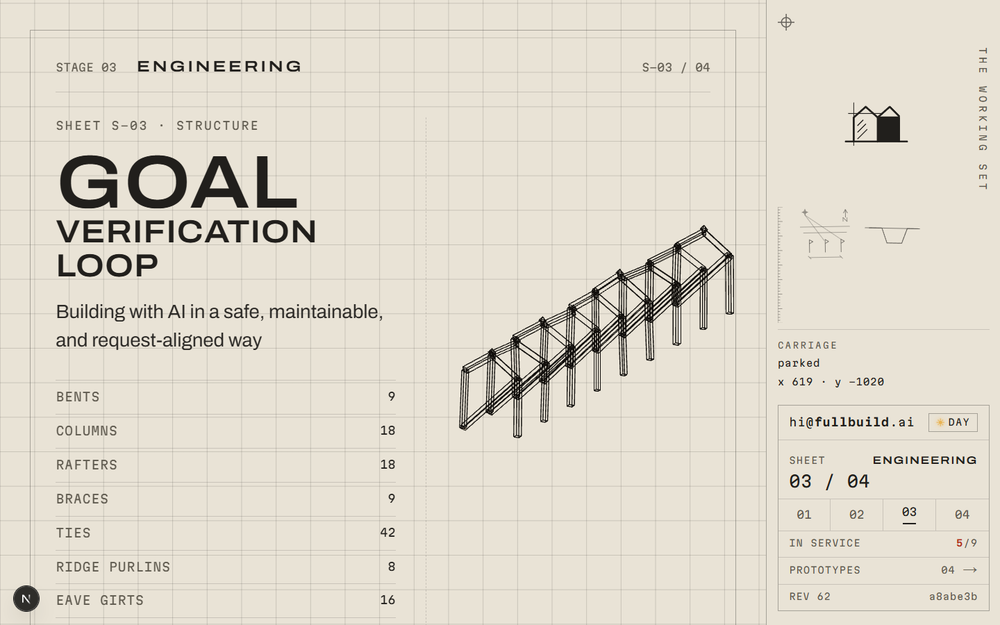
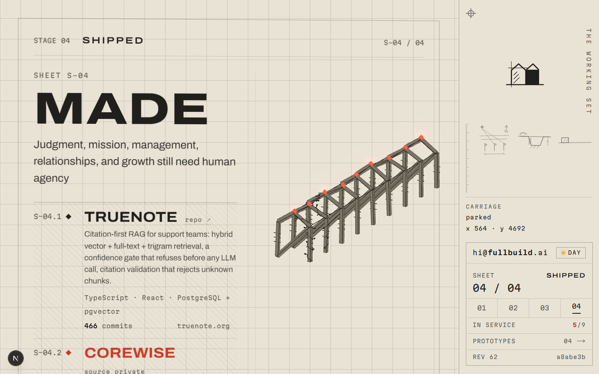

<a href="https://fullbuild.ai">
  
</a>

# fullbuild.ai

**[fullbuild.ai](https://fullbuild.ai)** · idea → design → engineering → audit ⟳ shipped

A portfolio built as an architect's working drawing set. Scrolling advances a
set of four sheets, and the drawing builds itself as you go: the same building
appears as a graphite sketch, then a dimensioned blueprint, then an isometric
structural frame, and finally the poured, finished thing, lit only where work
is actually live.

## The four sheets

| | |
|:---:|:---:|
|  |  |
|  |  |

- **STAGE 01 · IDEA** (graphite). A loose orthographic elevation plots itself
  on load, stroke by stroke, like a pen plotter.
- **STAGE 02 · DESIGN** (cyanotype). The sketch resolves into a dimensioned
  blueprint stating the design intent: type family, ink budget, base grid,
  motion verbs, contrast floor. Night mode drops the sheet onto dark paper.
- **STAGE 03 · ENGINEERING** (concrete). The load-bearing frame, drawn as an
  isometric wireframe and quantified in a real structural takeoff.
- **STAGE 04 · SHIPPED** (revision red). The pour: the frame fills with
  material, and the one accent colour ignites on whatever is live in
  production right now.

## The constraint contract

Rules govern the design, not taste. Coherence reads as intent:

- **Four inks, four meanings, never mixed.** Each pipeline stage owns one
  colour.
- **Revision red means exactly one thing:** live in production right now. A
  runtime health probe ([`src/lib/health.ts`](src/lib/health.ts)) de-ignites
  red back to graphite if a project goes down, so the accent can never assert
  what it can't prove.
- **The title-block `REV` field is the deployed commit**
  ([`src/lib/git.ts`](src/lib/git.ts)). The sheet revision is the repository
  revision.
- **Unknown facts render as empty witness lines**, never invented numbers.
- **No gradients, no glassmorphism, no backdrop blur.** Depth comes from
  linework and projection.
- **Three motion verbs only:** draw · hinge · pour.
- **Mono is the measured voice** (dimensions, stack, metrics). Prose is never
  mono.
- **`prefers-reduced-motion`** collapses the set into four fully composed
  static sheets.

## Stack

Next.js (App Router) · TypeScript · React Three Fiber (3D walk-through, in
progress) · GSAP + Lenis · Zustand · CSS Modules

Tailwind is deliberately absent. With no utility classes in the build, no
gradient or blur utility can leak in and break the contract.

## Adding real work

All shipped work lives in one typed file:
[`src/lib/projects.ts`](src/lib/projects.ts). Append an entry with a real
title, real `href`, real metrics, and `live: true`. The build sizes STAGE 04
to what actually exists, and a metric with `value: null` renders an honest
empty witness line instead of an invented number.

## Develop

```bash
npm install
npm run dev        # http://localhost:3000
npm run build      # production build
npm run typecheck  # tsc --noEmit
```

The screenshots in this README come from the capture harness in
[`scripts/capture.mjs`](scripts/capture.mjs): point it at a dev server on
port 3117, add `--dark` for night mode. It freezes the GSAP ticker before
each shot so the plotter, hinge, and pour land on stable frames.

## Built through RTK

The quiet workhorse behind this repo is **RTK**, a Rust CLI proxy that sits
between an AI agent and the terminal and strips the noise out of command
output before the model ever reads it: `git status`, `git diff`, `rg`, test
runs, all compressed to what actually matters. Same information, a fraction
of the tokens, so every session spends its context on the work instead of on
boilerplate.

The savings are measured, not estimated. Across 95,821 logged commands RTK
has filtered 79.5% of output tokens, 19.7 million tokens and counting, with
per-command before/after logs refreshed daily.

**See the running total at [savetokens.tips](https://savetokens.tips)**

## License

[MIT](LICENSE)
