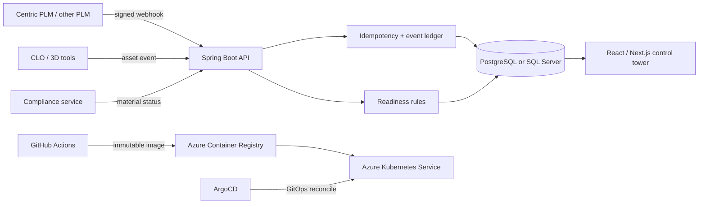

# Threadline

Threadline is an interview-ready prototype for an apparel Digital Product
Creation (DPC) team: a launch-readiness control tower that turns product,
material, compliance, 3D, and commerce events into one actionable view.

The interactive UI uses deterministic simulated data. The adjacent Spring Boot
service, database migrations, CI workflow, container, AKS manifests, and ArgoCD
application show how the concept crosses the full delivery lifecycle without
pretending that vendor systems or cloud infrastructure are connected.

## Two-minute interview demo

1. Open `/prototype/threadline` and frame the problem: a launch can miss its
   date even when every source system looks individually healthy.
2. Start at **Launch control**. Point out collection readiness, exception count,
   late styles, and integration health.
3. Select **Transit shell / MAT-214**. The style inspector connects the
   collection-level exception to its material, supplier, color, launch date, and
   milestone state.
4. Choose **Resolve demo issue**. The blocker closes, style readiness
   recalculates, and the critical-exception count drops without a page reload.
5. In **Integration pulse**, choose **Retry safely** on the failed Centric PLM
   event. The visible processing state becomes healthy and the affected style
   record advances.
6. Close with the production path: signed and idempotent webhooks enter Spring
   Boot, durable records land in PostgreSQL or SQL Server, GitHub Actions
   verifies and publishes an immutable image, and ArgoCD reconciles it into AKS.

Use **Reset demo** to return to the initial interview state.

## Product decision

The prototype is intentionally an exception workflow, not another reporting
dashboard. Product managers get a launch-level answer, operators get a ranked
queue and safe recovery action, and engineers get explicit integration,
security, persistence, and deployment boundaries.

Centric PLM and CLO are represented as integration adapters rather than
hard-coded dependencies. That keeps the core readiness model usable with other
PLM and 3D tools while still speaking directly to the role.

## System shape



## Role alignment

| Job requirement | Evidence in this prototype |
| --- | --- |
| Java / Spring Boot | Boot 4 API, validation, JPA, security, Actuator, focused unit tests |
| React / JavaScript | Responsive client-side workflow with selection, resolution, retry, reset, and live announcements |
| PostgreSQL / SQL Server | Vendor-specific Flyway baselines and runtime profiles |
| API integrations | HMAC verification, replay window, idempotency keys, payload hashing, durable integration-event state |
| Secure, high-performance code | Entra JWT boundary, constant-time signature comparison, paged projections, cache headers, pooled connections, constrained containers |
| GitHub / CI/CD | Contract, type, production-build, and Maven verification; OIDC Azure login; SBOM and provenance |
| Azure / AKS / ArgoCD | Hardened deployment, probes, resources, HPA, PDB, topology spread, network policy, workload identity, GitOps promotion |
| Apparel DPC / PLM | Style, material, color, supplier, milestone, collection, compliance, and 3D-asset vocabulary |

## API slice

| Method | Path | Purpose |
| --- | --- | --- |
| `GET` | `/api/v1/seasons/{season}/readiness` | Return a compact season projection and readiness summary |
| `GET` | `/api/v1/styles/{styleId}` | Return one style and its unresolved blockers |
| `POST` | `/api/v1/blockers/{blockerId}/resolve` | Resolve an exception and recalculate readiness |
| `POST` | `/api/v1/integrations/{source}/events` | Accept a signed, timestamped, idempotent vendor event |
| `POST` | `/api/v1/integrations/events/{eventId}/retry` | Mark a failed integration event for safe reprocessing |
| `GET` | `/api/v1/integrations/events` | Return the most recent integration pulse |
| `GET` | `/actuator/health/liveness` | Kubernetes liveness signal |
| `GET` | `/actuator/health/readiness` | Kubernetes readiness signal |

The demo UI currently runs from local fixtures so it remains dependable during
an interview. The types and state transitions mirror this API; replacing the
fixture loader with HTTP queries is an explicit next seam.

## Security and reliability choices

- Microsoft Entra ID JWT validation protects business endpoints; health probes
  remain anonymous.
- Vendor webhooks require `X-Webhook-Timestamp`, `X-Webhook-Signature`,
  `X-Correlation-Id`, and `Idempotency-Key`.
- Signatures cover the exact timestamp and request bytes, use HMAC-SHA256, and
  are compared in constant time. A five-minute replay window rejects stale
  requests.
- Idempotency stores the key plus a SHA-256 payload hash. Exact replays are
  acknowledged; key reuse with different content is rejected.
- Read models use repository projections instead of loading full aggregates;
  the integration stream uses bounded cursor pagination.
- The production pod runs as a numeric non-root user with a read-only root
  filesystem, dropped capabilities, seccomp, resource requests/limits, and
  graceful termination.
- Three replicas, anti-concentration topology rules, a disruption budget, and
  horizontal autoscaling preserve availability during releases and demand
  spikes.
- GitHub publishes an immutable SHA tag with SBOM and provenance. A reviewable
  manifest PR—not direct cluster mutation—promotes the image.

Secrets are deliberately absent. Production should source the database
password and webhook secret from Azure Key Vault through the Secrets Store CSI
driver or an approved external-secrets controller.

## Run locally

### Web experience

From the repository root:

```bash
npm ci
npm run dev
```

Open `http://localhost:3000/prototype/threadline`.

### Spring Boot API

Use Java 21+ and Maven 3.9+:

```bash
cd showcase/threadline/backend
mvn spring-boot:run
```

The default profile expects PostgreSQL:

```text
DB_URL=jdbc:postgresql://localhost:5432/threadline
DB_USER=threadline
DB_PASSWORD=<secret>
ENTRA_ISSUER_URI=https://login.microsoftonline.com/<tenant-id>/v2.0
WEBHOOK_HMAC_SECRET=<high-entropy-secret-of-at-least-32-characters>
```

For Microsoft SQL Server, activate `mssql` and use a JDBC SQL Server URL:

```bash
mvn spring-boot:run -Dspring-boot.run.profiles=mssql
```

## Delivery path

The reference workflow in
`.github/workflows/threadline-ci.yml` verifies both product surfaces on pull
requests. A `threadline-v*` tag uses GitHub OIDC federation to sign in to Azure,
builds the API image, attaches SBOM/provenance metadata, pushes an immutable
`sha-<commit>` tag to ACR, and opens a GitOps promotion pull request. After
review and merge, ArgoCD reconciles the production overlay.

Before using the manifests, replace the sample ACR host, Azure identity IDs,
tenant ID, DNS host, repository URL, and secret-provider bindings.

## Verification ledger

| Surface | Status | Evidence |
| --- | --- | --- |
| Frontend contract | Verified locally | Node contract tests cover route, gallery, interaction labels, accessibility hooks, and deployment artifacts |
| TypeScript | Verified locally | Strict `next` type checking passes |
| Production frontend | Verified locally | Next.js production compilation and static generation pass |
| Spring Boot | Verified locally | Maven `verify`: 10 tests, 0 failures, 0 errors, 0 skipped |
| Responsive UI | Verified locally | Codex Browser checks at desktop, tablet, 390 px, and 320 px widths |
| Interaction flow | Verified locally | Style selection, blocker resolution, readiness recalculation, integration retry, live announcement, and reset exercised |
| Container image | Not claimed | Docker is unavailable in the local environment; the Dockerfile is reviewable but was not built |
| PostgreSQL / SQL Server runtime | Not claimed | Migrations and profiles are implemented; no live database was attached locally |
| AKS / ArgoCD deployment | Not claimed | Reference manifests are implemented; no Azure subscription or cluster was mutated |
| Centric PLM / CLO connection | Not claimed | Adapter boundary and simulated events only; no vendor credentials or proprietary API contract was available |

## Design references

The product framing follows Centric Software's description of PLM as a
concept-to-commercialization backbone with 2D/3D integration. The deployment
shape follows Microsoft's AKS GitOps guidance and GitHub's documented
Java/Maven and container-publishing patterns:

- <https://www.centricsoftware.com/en-gb/what-is-centric-plm>
- <https://learn.microsoft.com/en-us/azure/architecture/example-scenario/gitops-aks/gitops-blueprint-aks>
- <https://spring.io/projects/spring-boot/>
- <https://docs.github.com/en/actions/tutorials/build-and-test-code/java-with-maven>
- <https://docs.github.com/en/actions/tutorials/publish-packages/publish-docker-images>
